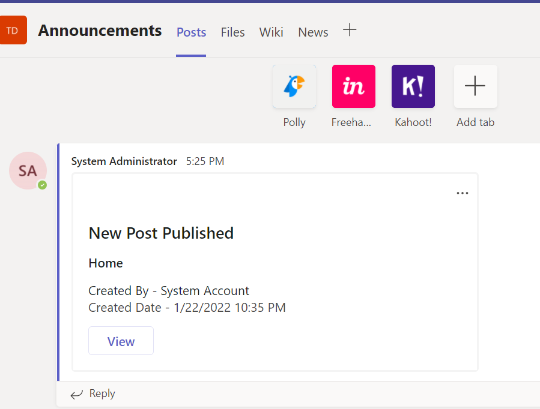

# Notify To Teams Group - SPFX ListView Command Set Extension

## Summary

ListView Command Set allows to extend command surfaces of SharePoint to add new actions. It supports toolbar and context menu.
**Notify To Teams Group** is a Command Set extension that can be used for posting updates from SharePoint Team Site to the Announcements channel in Teams. 

  

## Features

1. Clone this repository and deploy this solution (eoc-extension.sppkg) in the tenant and add it to all sharepoint sites.

2. Then **Notify To Teams Group** Command Set extension will be available in Site Pages library on all the SharePoint sites which begins with _teoc_.

3. User can select a page and select **Notify to Teams Group** in any Team Site as shown in the above image. It will then send a post to the Announcements channel (if available) of that Teams.

4. Once notified to teams group, user will be able to view the content in "Announcements" Channel.

    

## Used SharePoint Framework Version

## Applies to

- [SharePoint Framework](https://aka.ms/spfx)
- [Microsoft 365 tenant](https://docs.microsoft.com/en-us/sharepoint/dev/spfx/set-up-your-developer-tenant)

> Get your own free development tenant by subscribing to [Microsoft 365 developer program](http://aka.ms/o365devprogram)

## References

- [Getting started with SharePoint Framework](https://docs.microsoft.com/en-us/sharepoint/dev/spfx/set-up-your-developer-tenant)
- [Building for Microsoft teams](https://docs.microsoft.com/en-us/sharepoint/dev/spfx/build-for-teams-overview)
- [Use Microsoft Graph in your solution](https://docs.microsoft.com/en-us/sharepoint/dev/spfx/web-parts/get-started/using-microsoft-graph-apis)
- [Publish SharePoint Framework applications to the Marketplace](https://docs.microsoft.com/en-us/sharepoint/dev/spfx/publish-to-marketplace-overview)
- [Microsoft 365 Patterns and Practices](https://aka.ms/m365pnp) - Guidance, tooling, samples and open-source controls for your Microsoft 365 development

## Disclaimer

**THIS CODE IS PROVIDED *AS IS* WITHOUT WARRANTY OF ANY KIND, EITHER EXPRESS OR IMPLIED, INCLUDING ANY IMPLIED WARRANTIES OF FITNESS FOR A PARTICULAR PURPOSE, MERCHANTABILITY, OR NON-INFRINGEMENT.**

---
