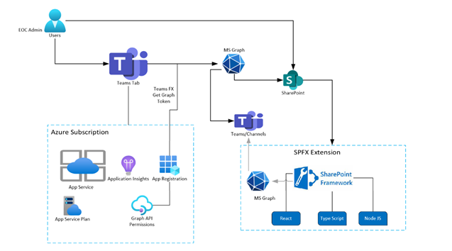

Microsoft Teams Emergency Operations Center (TEOC) is built using TeamsFx and React. The application is deployed in Microsoft Azure, SharePoint Tenant and installed to Microsoft Teams.

Below is the high level architecture of the various components involved in this application,

  