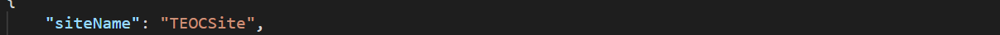
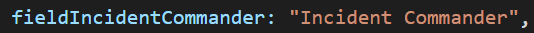
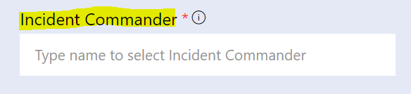
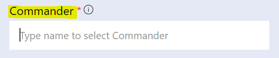
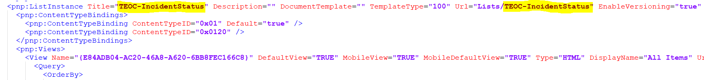
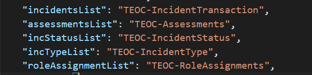
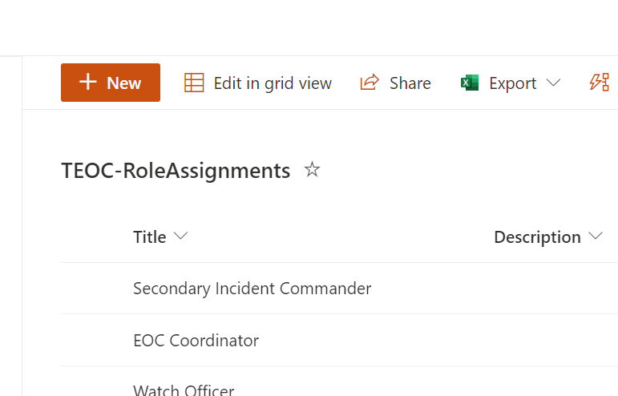
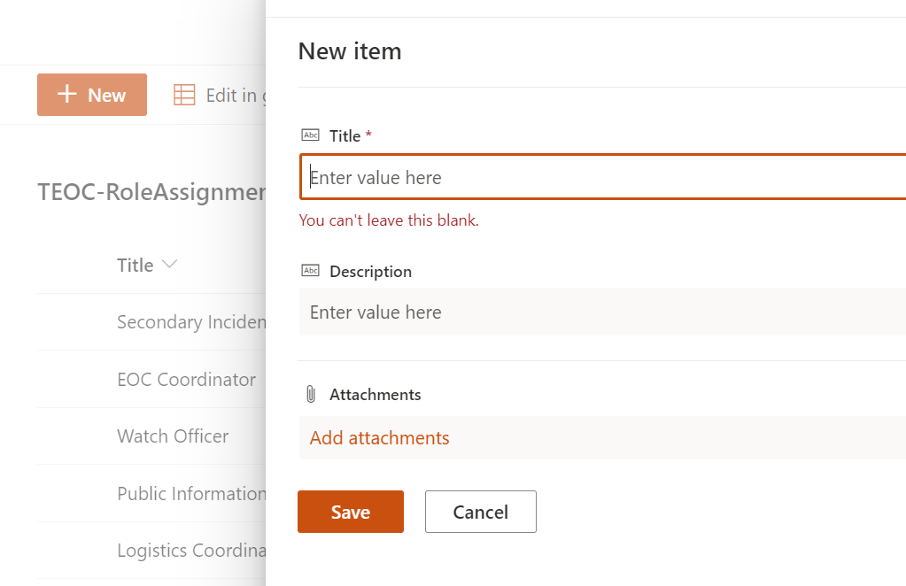
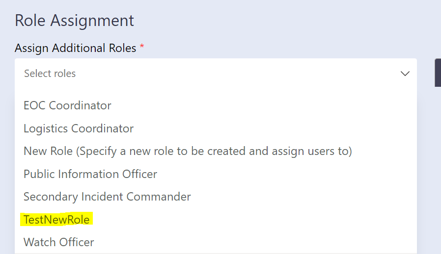

# Customizations

The customized installation makes the assumption you wish to change the default variables (site name, list names, labels, buttons text, logo etc.) with the TEOC Solution Template. Customizing the installation takes it outside of configurations we have tested against but allows you to modify any aspect of the template. 

```
Please note that if you customize the solution according to your organization needs, there are chances that you might face challenges while upgrading to new versions with the future releases.
```

## Prerequisites 

1. Install Visual Studio Code
1. Clone the app [repository](https://github.com/OfficeDev/microsoft-teams-emergency-operations-center.git) locally.

Below are the high level steps to get you started on a customizing the template.

## Site Name Customization
>**Site Name Customization is not applicable for TEOC v1.0 or higher.**

**Note:**  Please ensure to update Site Name before provisioning.

1.  Open the `Deployment/provisioning` folder to get the latest provisioning files i.e. `EOC-Provision.ps1` and `EOC-SiteTemplate.xml`
1.  Open `EOC-Provision.ps1`
    * Update EOCSiteURL value to new value. (Ex: `$EOCSiteURL = "/sites/NewSiteName"`)

        

    * Update Title property with new site name. (Ex: `New-PnPSite -Type TeamSiteWithoutMicrosoft365Group -Title NewSiteName -Url $TenantURL$EOCSiteURL -Owner $AdminEmail`)

        

1.  Open `EOC-TeamFx/tabs/src/config` folder in visual studio code.
1.  Open `siteConfig.json` file and update `siteName` with new site name.

    


## Text Label Customization

1. Open `EOC-TeamFx/tabs/src/locale` folder.
1. Open the component that you would like to modify and locate the constant name that you wish to modify. 
1. Open `LocaleStrings.ts` and update the constant value to the new value.

    

    Ex: If you wish to update `Commander Name` label to `Commander`, open the `LocaleStrings.ts` find `fieldIncidentCommander` and update its value.

    

    


## List Names Customization

**Note:**  Please ensure to update List Names before provisioning site.

1.  Open the `Deployment/provisioning` folder to get the latest provisioning files i.e `EOC-Provision.ps1` and `EOC-SiteTemplate.xml`
1.  Open `EOC-SiteTemplate.xml` file.
1.  Seach for `<pnp:ListInstance` and update the Title and URL property for specific list.

    

1.  Save the `EOC-SiteTemplate.xml` file and start provisioning site.
1.  Open `EOC-TeamsFx/tabs/src/config` folder.
1.  Open `siteConfig.json` file and update the list name

    


## List Values Customization

**Note:**  Please ensure to update List Values / Master values once provisioning is completed. If you want to update master data at later stage, if the value is already used while creating any incident and you are planning to update/delete that value then it might break existing records.

1.  Navigate to TEOC site in your tenant.
1.  Navigate to Site Contents.
1.  Below are master lists
    * TEOC-IncidentStatus
    * TEOC-IncidentType
    * TEOC-RoleAssignments
1.  Open Master List and click new to create new entry.

    

    

1.  Once New entry is added in Master, it will be reflected in Create New Incident / Update Incident form.

    

## Logo Customization and Specifications

**Note:**  Please ensure to keep same name for new logo images as the existing one.

1.  Open the `Deployment/appPackage/resources` folder. 
1.  Update `outline.png` & `color.png` with new logo images. 
1.  Open `EOC-TeamsFx/templates/appPackage/resources` folder.
1.  Update `outline.png` & `color.png` with new logo images.
1.  For logo specifications refer [this](https://docs.microsoft.com/en-us/microsoftteams/platform/concepts/build-and-test/apps-package#app-icons) link.


