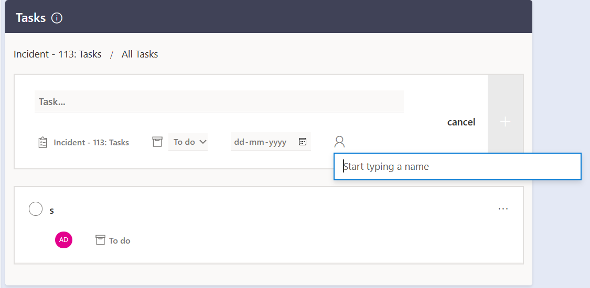
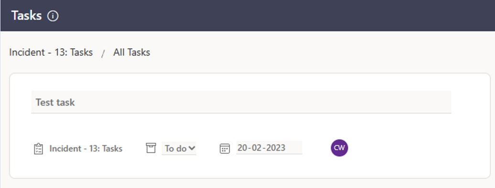
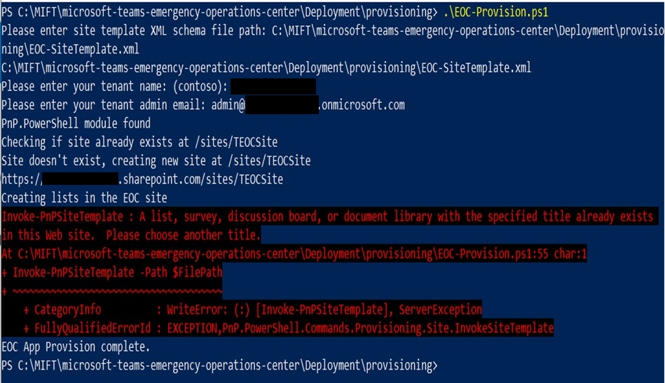
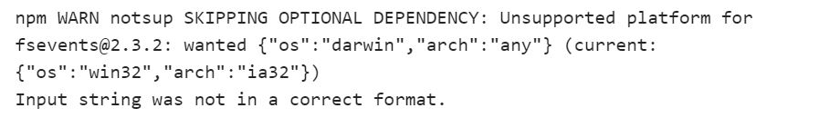

# Known Limitations

## 1. Tasks in Active Bridge component
Tasks in Active Bridge component has some known limitations as below -

- User can only search and assign the tasks to the people who are most relevant to the user in the People picker in Add Task section.( *Relevance is determined by the user’s communication and collaboration patterns and business relationships. People can be local contacts or from an organization’s directory, and people from recent communications.* )

- In GCCH tenant, task will not get added when it's assigned to some one through the People Picker, however user can still create a task without an Assignee.

# FAQs

## 1. Azure deployment failed with conflict error, what do I need to do?
Deployment can fail if the base resource name provided is not available and you could see conflict error. Choose a different "Base Resource Name". You can check if your desired name is available by going to the page to [create a new web app](https://portal.azure.com/#create/Microsoft.WebSite) in the Azure Portal. Enter your desired name in the "App name" field. An error message will appear if the name you have chosen is taken or invalid.

## 2. Provisioning failed with error, what do I need to do?
Provisioning can fail due to some network issue. If it failed and TEOC site collection is created in your tenant then delete the site collection from Active sites as well as Deleted sites. Run the provisioning script again.

## 3. Upgrading to latest version failed with error, what do I need to do?
App service deployment fails with the error message “Input string was not in a correct format” due to fsevents package.

The fsevents library is causing the app service deployment to fail for already deployed apps.

-	Go to portal.azure.com. 
-   Navigate to resource group where all TEOC resources are deployed.
-	Click on the app service.
-   Click on Configuration.
-	Click on WEBSITE_NODE_DEFAULT_VERSION.
-	Update the default value to 16.13.0 (previous value ~14) and save.
-	Click on overview and re-start the app service.
-	Once the app service is restarted. Navigate to Deployment Center and click on Sync.
-	Wait till the deployment is completed. You can validate this once the status changes to Success under logs. 

 ## 4. Does the app support multiple locales?

 Yes, TEOC v1.0 supports the translations for below 12 languages, 

- Arabic (SA)
- Chinese
- Chinese (TW)
- English (US)
- French
- German
- Hebrew
- Japanese
- Korean
- Portuguese (BR)
- Russian
- Spanish

## 5. Does the app support mobile devices?

Yes, TEOC v1.0 supports the desktop, mobile and tab devices.

## 6. Does the app works in GCC/GCCH tenant?

Yes, TEOC v2.0 works in Commercial, GCC and GCCH tenants.