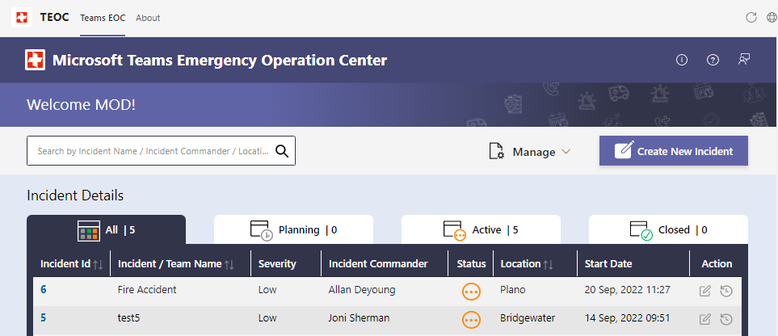

# Microsoft Teams Emergency Operation Center

The Microsoft Teams Emergency Operations Center (TEOC) solution template leverages the power of the Microsoft 365 platform to centralize incident response, information sharing and field communications using powerful services like Microsoft Lists, SharePoint and more. An open-source solution supported by Microsoft. it provides core functionality out of the box or can be extended to meet specific agency requirements.

   