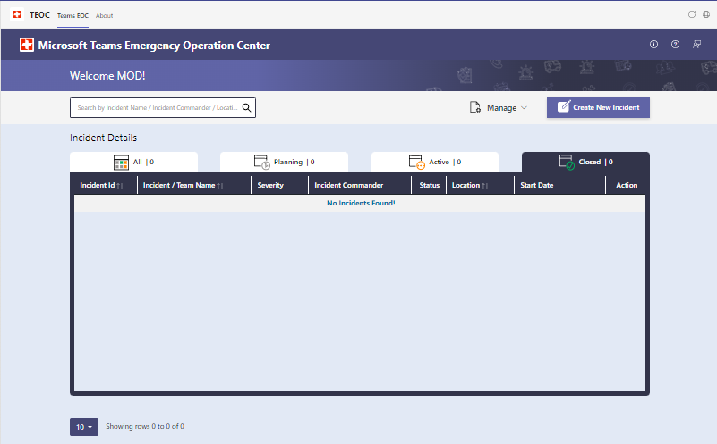
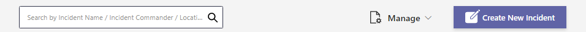
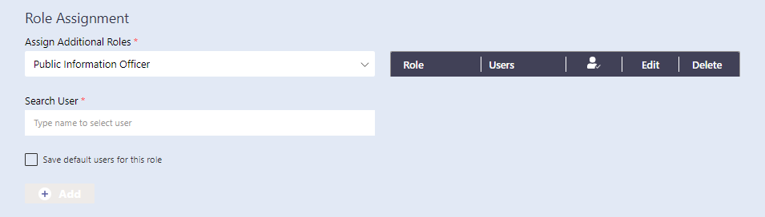
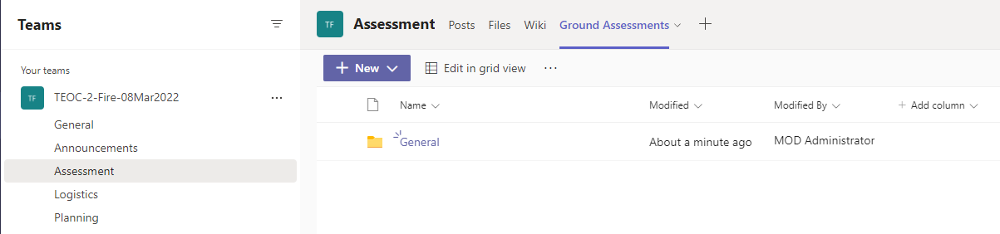
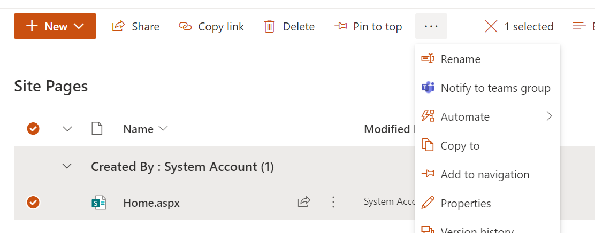

## Overview

1. The current version of the Microsoft Teams Emergency Operations Center operates as an app in Microsoft Teams that is installed locally in your tenant by your tenant administrator or any user who has the capability to side load the application.
2. Once installed, it can be accessed via "+Add a tab" option at the top of the channel within a team. **Channel > Add a tab > TEOC**
3. The app will enable users to create new incidents, modify existing incidents and view the incidents on a dashboard.
4. The app will create Teams channel for each incident with default channel groups so that users track the activities for each incident in specific Teams channel
5. There are 3 major components in the Microsoft Teams Emergency Operations Center App -
    1. Incident Details Dashboard
    2. New Incident Form
    3. Update Incident Form

## First Load Experience

1. When the app is launched for the first time, it will show a login button to the users as below -

    

2. On click of "Login" button, a pop up will open which will list all the required permissions that the app needs. If you're an IT admin, you can check the checkbox for "Consent on behalf of your organization" to grant the permissions for all users.

    

3. Once you accept the permissions, app will load, and "Dashboard" will appear.

    

## Incident Details Dashboard

1. The Dashboard shows the list of all incidents. A user can sort the incidents by "Incident Id", "Incident/ Team Name" or "Location" by clicking on the headers.
2. There are 4 tabs on the dashboard which shows incidents based on status. First tab shows all incidents irrespective of status and remaining 3 are Planning, Active and Closed.
3. Users can use the search box at the top to filter out the grid based on Incident Name, Incident Commander, and Location.
4. Users can click on **Create New Incident** button to navigate to New Incident Form.
5. Users can click on **Edit** button to edit an existing incident.
6. Users can click on Incident Number to navigate to the Teams channel associated with that incident.

    

7. On top right corner of the ribbon, there are 3 icons - "More Info", "Support", and "Feedback".
   1. More Info - Provides more details about the app such as version number, git hub links for latest version of app and Wiki links.
   2. Support - This link redirects to a support page where the users can raise queries related to the app.
   3. Feedback - This links redirects to a feedback page to share the feedback for the app.

## Create Incident

1. From dashboard, on click of "Create New Incident" button the user will be redirected to create new incident form where user can add details and create an incident.

    

2. All the fields mentioned in the section "Incident Form Details" are mandatory to create in incident.

    

3. "Role Assignment" is an optional section to add users to the incident in additional roles.

    

4. From Assign Additional Roles dropdown, user will be able to select roles which are present by default in the system and user will be able to add users who will be performing that role in the incident. 

5. On click of Add button, that role will be added to the incident.

    > Note: If Add button is not clicked, role will not be added for that incident even though you have selected Role and assigned user for that role in the form.

6. A new role can be added by selecting "New Role" option from the "Assign Additional Roles" dropdown, providing "Role Name" and clicking on "Create Role" button.

    

7. On click of "Create New Incident", incident will be created, and user will be redirected to dashboard where newly added incident and details will be present. 

8. Along with incident below mentioned entities will also be created. 

    * Teams will be created with 6 channels - General, Announcement, Assessment, Logistics, Planning and Recovery.
    * Incident Commander along with the user who created incident will be added as owners to the Teams.
    * Users added during Role assignment will be added as members to the Teams.
    * Tags will be created for roles added in the incident. Incident Commander tag will be created by default.

## Edit Incident

1. From Dashboard, on click of "Edit" button for an incident, the user will be redirected to Edit Incident form where they will be able to modify details of the incident. All the fields except "Incident Type" and "Start Date & Time" are editable.

    

    

2. Below points to note while updating the incident,
    * If the Incident commander is updated, old incident commander is removed from the team and the tag as well.
    * If a person is removed from any roles, that person will be removed from the teams membership as well.
    * If a role is deleted, respective tag will also be deleted from the team.

## Notify to Teams Extension

1. **Notify To Teams** option can be used for posting updates from SharePoint site to Announcements channel in Teams.
2. User can navigate to Teams site created using below steps,
    * Navigate to the team and go to "Assessment" Channel.
    * Click on "Ground Assessment" tab.    
    
    

3. When you click on ellipses you will find an option to "Open in SharePoint".

    

4. User will be navigated to SharePoint site. From Left navigation users can navigate to "Pages" Library.

5. If user want to share the content already present in any of the page, user can simply select the page and select **Notify to Teams Group** as below.

    

6. Once notified to teams group, user will be able to view the content in "Announcements" Channel.

    