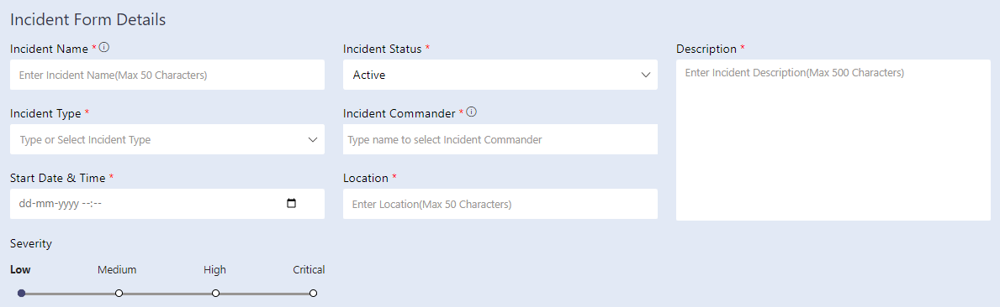
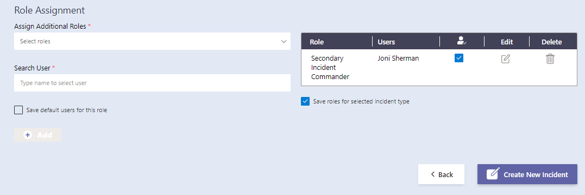
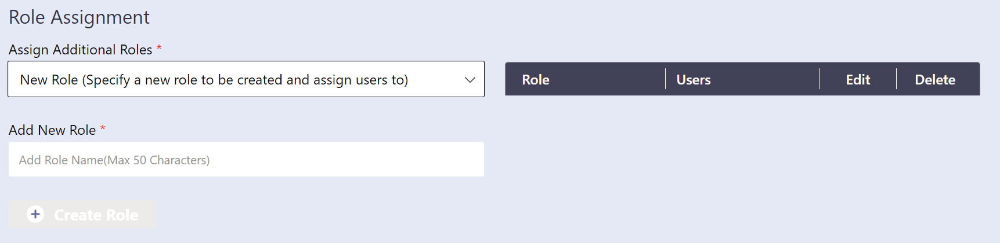
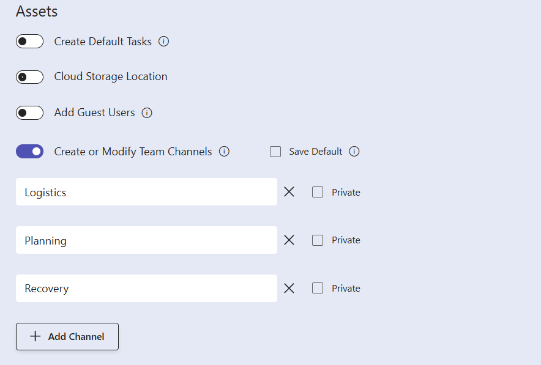
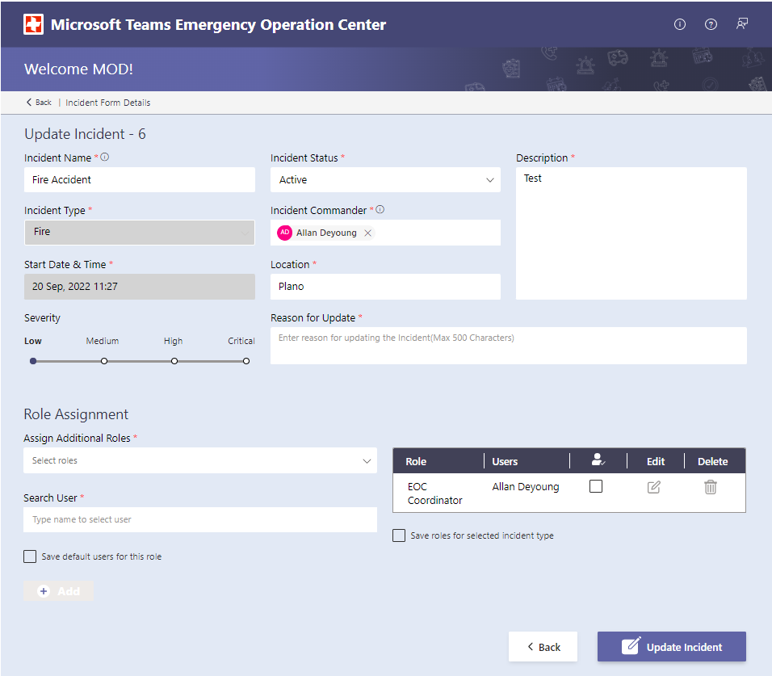
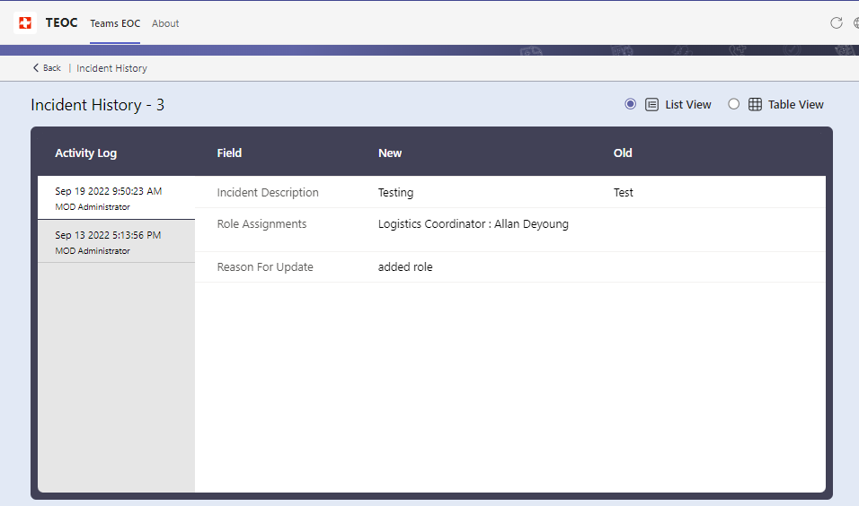
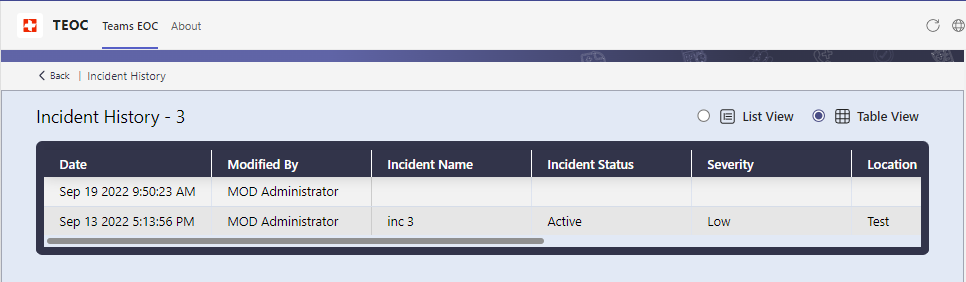
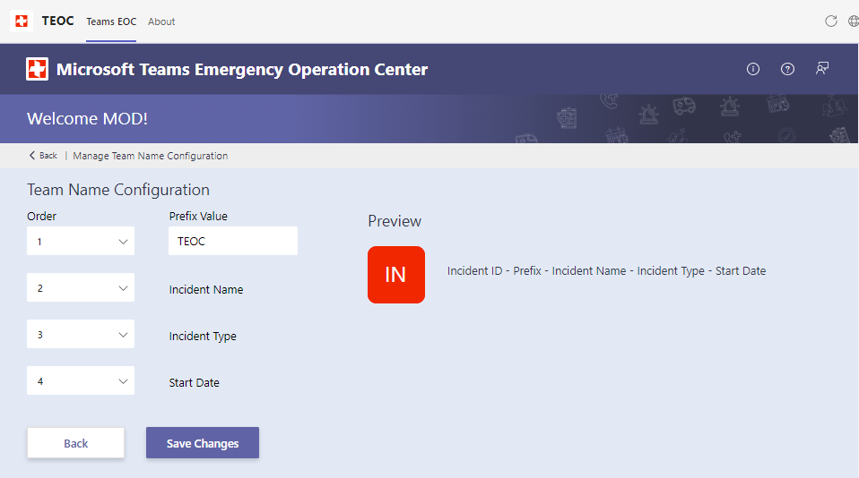

## Overview

1. The current version of the Microsoft Teams Emergency Operations Center operates as an app in Microsoft Teams that is installed locally in your tenant by your tenant administrator or any user who has the capability to side load the application.
1. Once installed, it can be accessed via "+Add a tab" option at the top of the channel within a team. **Channel > Add a tab > TEOC**
1. The app will enable users to create new incidents, modify existing incidents and view the incidents on a dashboard.
1. The app will create a team for each incident with default channel so that users track the activities for each incident in specific structured Teams channels.
1. There are 5 major components in the Microsoft Teams Emergency Operations Center App -
    1. Incident Details Dashboard
    1. Create New Incident Form
    1. Edit Incident Form
    1. Active Dashboard
    1. View Incident History
    1. Admin Settings

## First Load Experience

1. When the app is launched for the first time, it will show a login button to the users as below -

    

1. On click of "Login" button, a pop up will open which will list all the required permissions that the app needs. If you're an Microsoft 365 admin, you can check the checkbox for "Consent on behalf of your organization" to grant the permissions for all users.

    

1. Once you accept the permissions, app will load, and "Dashboard" will appear.

    

## Incident Details Dashboard

1. The Dashboard shows the list of all incidents. A user can sort the incidents by "Incident Id", "Incident/ Team Name" or "Location" by clicking on the headers.
1. There are 4 tabs on the dashboard which shows incidents based on status. First tab shows all incidents irrespective of status and remaining 3 are Planning, Active and Closed.
1. Users can use the search box at the top to filter out the grid based on Incident Name, Incident Commander, and Location.
1. Users can click on **Manage** button that navigates to SharePoint lists to manage Incident Types and Roles and Admin Settings screen to configure Team Name and Enable Role Settings.
1. Users can click on **Create New Incident** button to navigate to New Incident Form.
1. Users can click on **Active Dashboard** icon to join bridge, post announcements and manage planner tasks of an existing incident.
1. Users can click on **Edit** icon to edit the details of an existing incident.
1. Users can click on **View Incident History** icon to view the version history of an existing incident.
1. Users can click on Incident Number to navigate to the General Channel of the Team associated with that incident.

    

1. On top right corner of the ribbon, there are 3 icons - "More Info", "Support", and "Feedback".
   1. More Info - Provides more details about the app such as version number, git hub links for latest version of app and Wiki links.
   1. Support - This link redirects to a support page where the users can raise queries related to the app.
   1. Feedback - This links redirects to a feedback page to share the feedback for the app.
1. Admins can click on "Admin Settings" from the "Manage" menu for managing "Team Name Configuration" and "Role Settings".

## Create Incident

1. From dashboard, on click of "Create New Incident" button the user will be redirected to create new incident form where user can add details and create an incident.

    

1. All the fields mentioned in the section "Incident Form Details" are mandatory to create an incident.

    

1. "Role Assignment" is an optional section to add users to the incident in additional roles.

    

1. From Select Role dropdown, user will be able to select roles which are present by default in the system and user will be able to add users and a lead who will be performing that role in the incident. 
    > **Note: Users who are added to the role 'Secondary Incident Commanders' will be added as owners to the Incident Teams**

1. User can additionally check "Save default users for this role" checkbox, by doing so the assigned users and role lead will be auto populated for that specific role while creating new incidents thereafter. On click of Add button, that role will be added to the Role Assignment table.

    > **Note: If Add button is not clicked, role will not be added for that incident even though you have selected Role and assigned user for that role in the form.**

1. User can also check "Save roles for selected incident type" checkbox, by doing so the roles, users and lead will be auto populated in the Role Assignment table for that specific incident type while creating new incidents thereafter.

    

1. A new role can be added by selecting "New Role" option from the "Assign Additional Roles" dropdown, providing "Role Name" and clicking on "Create Role" button.

    

1. Assets section provides an option to add guest users, add cloud storage location and to create/modify the additional Team Channels.

     

     * "Add Guest Users" is available in both Create and Edit Incident form and user can add guest users while creating or editing an incident. User can add up to 10 guest users at a time by clicking on Add More button. Once the guest users are added, it will be available in the people picker selection for the next time when the incident is edited and user can select them for any roles except Secondary Incident Commander and Incident Commander.

     * "Cloud Storage Location" is available only in Create Incident form and user can add the link to the cloud storage location that is used to maintain the files related to the incident. User can select the Save Default option to save the entered location as the default value for the incident type, so it will be prepopulated for any new incident created thereafter with the same incident type. This link cannot be changed after the incident is created.

     * "Create or Modify Team Channels" is available only on Create New Incident Form. By default the teams will be created with "General", "Announcements" and "Assessment" Channels. The user can configure additional channels to be created in this section. "Logistics", "Planning", "Recovery" are pre populated in this section as suggestions. User can select the "Save Default option" to save the default channels for the incident type, so it will be prepopulated for any new incident created therafter with the same incident type.
     
        

1. On click of "Create New Incident", incident will be created, and user will be redirected to dashboard where newly added incident and details will be present. 

1. Along with incident below mentioned entities will also be created. 

    * A Team will be created with default 3 channels - General, Announcements, Assessment and any additional channels that are added in Create or Modify Team Channels section.
    * Users assigned with Secondary Incident Commander role, Incident Commander and the user who creates the incident will be added as owners to the Team.
    * Users added in the Role assignment section except Secondary Incident Commander will be added as members to the Team.
    * Tags will be created for roles added in the incident. Incident Commander tag will be created by default.
    * Planner plan will be created for the Team and the Tasks app will be added as a tab in the General Channel.
    * News tab will added to the Announcements Channel to show all the news posted on the Team Site.
    * Ground Assessments list will be created in the Team Site and added as a tab to Assessment Channel.
    * Adaptive card message will be posted to the General Channel to notify all the Team members about the creation of a team for the incident.

## Edit Incident

1. From Dashboard, on click of "Edit" button for an incident, the user will be redirected to Edit Incident form where they will be able to modify details of the incident. Only owners of the team can edit an incident. All the fields except "Incident Type" and "Start Date & Time" are editable. _It is mandatory to enter Reason for Update while editing the incident_.

    

1. Below points to note while updating the incident,
    * If the Incident commander is updated, old incident commander is removed from the team and the tag as well.
    * If a person is removed from any roles, that person will be removed from the teams membership as well.
    * If a role is deleted, respective tag will also be deleted from the team.

## Active Dashboard

1. From Dashboard, on click of "Active Dashboard" button for an incident, the user will be redirected to Active Dashboard screen where they will be able to Create/Join bridge, post announcements, manage the planner tasks and more. Only owners and members of the team can have access to the active dashboard screen.

        

    * Under "Team", the users assigned to any role on the incident will be listed below the respective roles. From this section user can click on "Post Announcement" to post a message to the Announcements Channel. There is an option to include bridge link and the priority (Important) on the message. Add Members button will be available only for Team owners and it will be redirected to the Edit incident form to add/modify members on the incident.
    
    

    * Under "Bridge", the team owners can Activate (Create an Instant Meeting) a bridge. Once activated, the team members can "Join Bridge" anytime.Below are other options in this section -
       * Edit - Visible to Team owners and it is redirected to Edit Incident form.
       * Incident History - This will redirect the users to Incident History screen.
       * Team Chat - This will redirect the users to the "Posts" tab in "General" Channel.
       * News - This will redirect the users to the News tab in "Announcements" Channel.

    * Under "Tasks" section, user will be able to view, add and manage tasks for the plan created for the incident. Additionally, "Tasks by Planner and To Do" app is added as a tab to the "General" Channel and users can access the planner tasks from there as well.

## Incident History

1. From Dashboard, on click of "View Incident History" icon for an incident, the user will be redirected to  Incident History screen. By default, user will see the details in list view. User can click on any version listed under the activity log to view the changes for that version.

           

1. On click of "Table View" option, user can see the incident changes for all versions in the table format. "Date" and "Modified By" are the sticky columns and user can use the scroll bar to view other columns. 
If there are any changes to the Roles, _View_ link will be available on the Roles column and it will open a popup to show the role changes for that version.

    

## Manage Options

1. From Dashboard, on click of "Manage" button the menu will appear with the available options.
   
   

1. On click of "Incident Types", user will be redirected to the SharePoint list to manage the incident types.

1. On click of "Roles", user will be redirected to the SharePoint list to manage the roles.

1. On click of "Admin Settings", user will be redirected to the Admin Settings page. 
   * In the "Team Name Configuration" tab, user can configure the format of the Team Name. Upon saving the configuration, the incidents created/edited thereafter will have the Team Name in that newly configured format.

           

   * In the "Role Settings" tab, user can enable the "Role based access" to control access for the "Manage" and "Create New Incident" options in the Dashboard. 

         

   * Upon enabling the role and saving the setting, the current user details will be added with "Admin" role in the "T"EOC-UserRoles" SharePoint list. User can click on "Assign Roles" link to add additional users with "Admin" role and only the users available in the "TEOC-UserRoles" list will be able to "Manage" and "Create New Incident" thereafter. User can also disable the role based access for the application at any time by turning off this toggle button.

         

## Notify to Teams Extension

1. **Notify To Teams** option can be used for posting updates from SharePoint site to Announcements channel in Teams.
1. User can navigate to Teams site created using below steps,
    * Navigate to the team and go to "Assessment" Channel.
    * Click on "Ground Assessment" tab.    
    
    

1. When you click on ellipses you will find an option to "Open in SharePoint".

    

1. User will be navigated to SharePoint site. From Left navigation users can navigate to "Pages" Library.

1. If user want to share the content already present in any of the page, user can simply select the page and select **Notify to Teams Group** as below.

    

1. Once notified to teams group, user will be able to view the content in "Announcements" Channel.

    