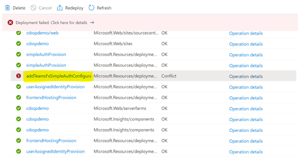
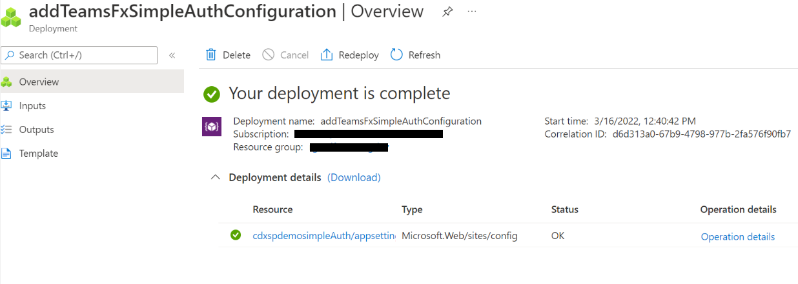

# General Template issues

## Problems deploying to Azure

### 1. App service name already exists

`Website with given name <name> already exists.`

`Creating resources of type "Microsoft.Web/sites" failed with status "Conflict"`

This happens when Azure web apps with the name `[BaseResourceName]` or `[BaseResourceName]-config` already exist.

### Fix

Choose a different "Base Resource Name". You can check if your desired name is available by going to the page to [create a new web app](https://portal.azure.com/#create/Microsoft.WebSite) in the Azure Portal. Enter your desired name in the "App name" field. An error message will appear if the name you have chosen is taken or invalid.

### 2. Resource location doesn't support Application Insights

`The subscription is not registered for the resource type 'components' in the region '<region>'. Please re-register for this provider in order to have access to this location.`

`Creating resources of type "microsoft.insights/components" failed with status "Conflict"`

This happens when Application Insights is not available in the Azure datacenter location where you chose to create the app.

### Fix

Create the resource group in a location where Application Insights is available. For an up-to-date list of these locations, refer [here](https://azure.microsoft.com/en-us/global-infrastructure/services/?products=monitor), under "Application Insights".

### 3. Deployment failed with one or more resource as 'Conflict'

Click on the Operation details, check for the error message. If the error message is **Gateway error**, this can occur due to network issues.



### Fix

* If multiple resources failed due to same error, recommendation is to clear out the existing resources and re-deploy the template from start.
* If anyone resource has failed like _addTeamsFxSimpleAuthConfiguration_,

    * Click on the failed resource template. 
    * Click on Redeploy as template for the specific resource can be re-deployed separately.
    * Provide the parameters specific to the template.
    * Verify if the deployment has been successful.

        


## Problems installing the app in Teams

### 1. Missing entrypoint to upload custom app

You don't see the entry points to upload an app, either using the [Store](https://docs.microsoft.com/en-us/microsoftteams/platform/concepts/apps/apps-upload#upload-your-package-into-a-team-or-conversation-using-the-store) or using the [Apps tab](https://docs.microsoft.com/en-us/microsoftteams/platform/concepts/apps/apps-upload#upload-your-package-into-a-team-using-the-apps-tab).

This is most likely because sideloading of external apps is not enabled in your tenant. See [here](https://docs.microsoft.com/en-us/microsoftteams/admin-settings) for more information.

## Problems in running PowerShell Script

### 1. Error in registering PnP Powershell App in Azure.

If you see any errors related to missing PnP PowerShell modules, ensure to install these pre-requisites and try again.

### Prerequisites to run the PowerShell Script

You only need to follow these steps ONCE for a specified Windows machine.

* Open a PowerShell console as an administrator (right-click, Run As Administrator).
    >Note: The latest version of PnP.PowerShell is cross-platform and works with PowerShell Core (v7.x).
* Ensure unrestricted execution policy is set in your machine. By default, the execution policy is restricted for windows computer. You may change it back to restricted after deployment is completed.
    >Note: Non-windows computer users can skip this as it is unrestricted by default for them.
    ```
    Set-ExecutionPolicy -ExecutionPolicy RemoteSigned
    ```

* Check the installed version of PowerShellGet with the following cmdlet:
    ```
    Get-PackageProvider -Name PowerShellGet -ListAvailable​
    ```
* If you see version 2.2.5.0 or greater, skip the next two bullets.
    >Note: If you have PowerShell 5.1 and 7.x installed, you may have different versions of PowerShellGet for each version of PowerShell.
* Install the required version of PowerShellGet with:
    ```
    Install-PackageProvider -Name Nuget -Scope AllUsers -Force
    Install-PackageProvider -Name PowerShellGet -MinimumVersion 2.2.5.0 -Scope AllUsers -Force​
    ```
* Close and reopen your PowerShell console (again, as an administrator).
* Install PnP.PowerShell with the following:
    ```
    Install-Module -Name PnP.PowerShell -AllowPrerelease -SkipPublisherCheck -Scope AllUsers -Force​
    ```
* Close and reopen your PowerShell console (run as administrator not required this time).
* Confirm that PnP.PowerShell is installed with the following:
    ```
    Get-Module -Name PnP.PowerShell -ListAvailable​
    ```

## Didn't find your problem here?

Please report the issue [here](https://github.com/OfficeDev/microsoft-teams-emergency-operations-center/issues/new)

