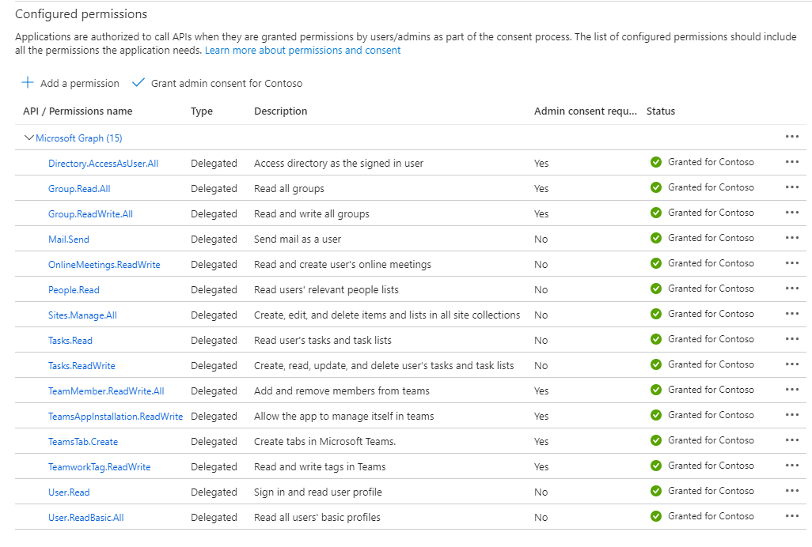

## Upgrade to version 2.0 from 1.0 or 0.5/0.5.1 

### 1. Run the upgrade PowerShell script
  
  1. Clone the [repository](https://github.com/OfficeDev/microsoft-teams-emergency-operations-center.git) locally. Open the `Deployment/provisioning/Upgrade` folder to get the latest provisioning files i.e `Update-EOC-Provision.ps1` and `Update-EOC-SiteTemplate-From-V1.0.xml` ( If you are upgrading the app from 1.0 version ) or `Update-EOC-SiteTemplate-From-V0.5.xml` ( If you are upgrading the app from 0.5 or 0.5.1 version )

  2. Run the PowerShell script (Update-EOC-Provision.ps1) as an Administrator, script will ask for below inputs:
    
    * XML file path – enter fully qualified path of the XML file (Ex: C:\Scripts\Update-EOC-SiteTemplate-From-V1.0.xml) 
    * Tenant Name – Name of the tenant where the SharePoint site was already provisioned (Ex: Contoso)
    * SharePoint site name – Enter your existing TEOC site name (Ex: TEOCSite)
 
  

  3. Once the above script is completed, then run the script (`EOC-UpdateLookupColumn.ps1`) as an Administrator, script will ask for below inputs:

    * Enter the TEOC Site URL - enter the absolute URL of the TEOC SharePoint site. (Ex: https://contoso.sharepoint.com/sites/TEOCSite)

  

  This script will copy the value from the existing IncidentStatus column to a new Status column in the TEOC-IncidentTransaction List. Please wait for the script to complete as it will take sometime depending on the number of items on the list.

### 2. Add new application setting in the App Service ( **This step is applicable only if you upgrade the app from 0.5 or 0.5.1 version** )

  1. In Azure portal, navigate to TEOC resource group, open app service and click on Configuration.

  2. Click on "New application setting" and add **REACT_APP_SHAREPOINT_SITE_NAME** as the Name and **TEOCSite** as the value and click on OK.
  >Note: If you have already customized the site name during inital deployment, then use that sitename instead of TEOCSite.

 
  

### 3. Sync latest version

  1.  In Azure portal, navigate to TEOC resource group, open app service and click on deployment center.

  2.  Click on sync.

  3.  Wait until you see status as success for sync.

### 4 . Add additional API Permissions to the TEOC Azure application.

1. In Azure Portal, navigate to App registrations and open the TEOC Azure application.

1. Select **API Permissions** blade from the left hand side.

1. Click on **Add a permission** button to add permission to your app.

1. In the fly out, click **Microsoft Graph**, then select **Delegated permissions** and enter the following permissions one by one,

    *  Tasks.Read
    *  Tasks.ReadWrite
    *  Group.Read.All
    *  OnlineMeetings.ReadWrite
    *  TeamsAppInstallation.ReadWriteSelfForTeam
    *  Mail.Send

1. Click on **Add Permissions** to commit your changes.

1. Reach out to your IT admin team to grant consent for the permissions provided. If you’re an admin, click on Grant the admin Consent for ******* 

    

### 5. Update version

1.  Delete existing app from teams admin center.

2.  Refer [6.Create the Teams app packages](https://github.com/OfficeDev/microsoft-teams-emergency-operations-center/wiki/Deployment-Guide#6-create-the-teams-app-packages) section of deployment guide.

3.  Refer [7.Install the app in Microsoft Teams](https://github.com/OfficeDev/microsoft-teams-emergency-operations-center/wiki/Deployment-Guide#7-install-the-app-in-microsoft-teams) section from deployment guide to upload updated zip.

### 6. Launch the TEOC app in Teams.

1. When the app is launched for the first time after the upgrade, it may show a login button to the users as below -

    

1. On click of "Login" button, a pop up will open which will list all the required permissions that the app needs. If you're an Microsoft 365 admin, you can check the checkbox for "Consent on behalf of your organization" to grant the permissions for all users.

    

1. Once you accept the permissions, app will load, and "Dashboard" will appear.

    

