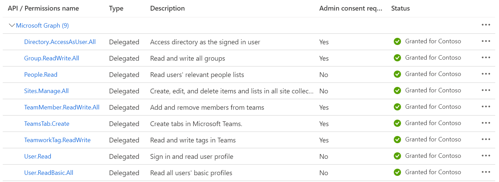
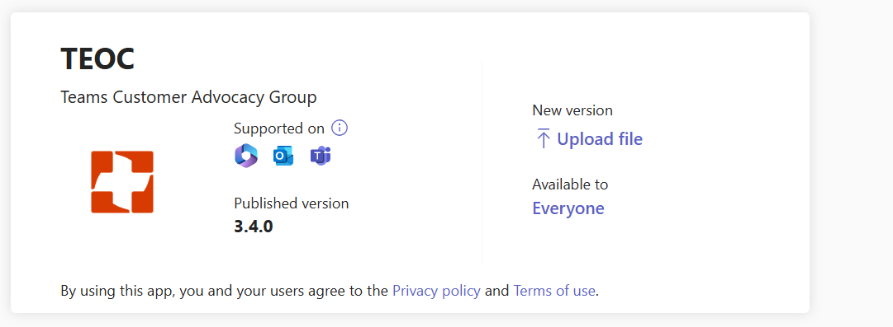
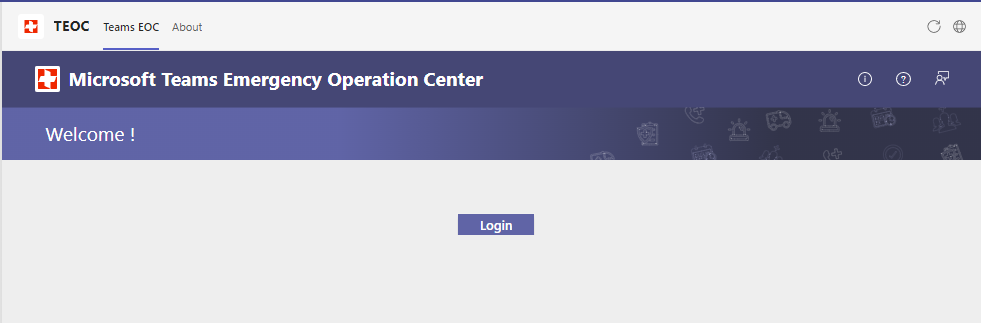

## Upgrade to v3.1  

### 1. Modify the column type of "Location" ( **This step is applicable only if you upgrade the app from 2.0 or older ** )

  1. Navigate to the "Site Contents" page of the TEOC Sharepoint site.

  1. Click on "Settings" for "TEOC-IncidentTransaction" list.

  

   
  3. On the settings page click on "Location" and modify the column type from "Single line of text" to "Multiple lines of text", select "Specify the type of text to allow" as "Plain text" and "Save".
  
  

    
### 2. Run the upgrade PowerShell script ( **This step is applicable only if you upgrade the app from 1.0 or older ** )
  
  1. Clone the [repository](https://github.com/OfficeDev/microsoft-teams-emergency-operations-center.git) locally. Open the `Deployment/provisioning/Upgrade` folder to get the latest provisioning files i.e `Update-EOC-Provision.ps1` and `Update-EOC-SiteTemplate-From-V1.0.xml` ( If you are upgrading the app from 1.0 version ) or `Update-EOC-SiteTemplate-From-V0.5.xml` ( If you are upgrading the app from 0.5 or 0.5.1 version )

  2. Run the PowerShell script (Update-EOC-Provision.ps1) as an Administrator, script will ask for below inputs:
    
    * XML file path – enter fully qualified path of the XML file (Ex: C:\Scripts\Update-EOC-SiteTemplate-From-V1.0.xml) 
    * Tenant Name – Name of the tenant where the SharePoint site was already provisioned (Ex: Contoso)
    * SharePoint site name – Enter your existing TEOC site name (Ex: TEOCSite)
 
  

### 3. Update old column "IncidentStatus" to new Lookup column "Status" ( **This step is applicable only if you upgrade the app from 1.0 or older ** )
  
 Once the above script is completed, then run the script (`EOC-UpdateLookupColumn.ps1`) as an Administrator, script will ask for below inputs:

    * Enter the TEOC Site URL - enter the absolute URL of the TEOC SharePoint site. (Ex: https://contoso.sharepoint.com/sites/TEOCSite)

  

  This script will copy the value from the existing IncidentStatus column to a new Status column in the TEOC-IncidentTransaction List. Please wait for the script to complete as it will take sometime depending on the number of items on the list.

### 4. Add new application setting in the App Service ( **This step is applicable only if you upgrade the app from 0.5 or 0.5.1 version** )

  1. In Azure portal, navigate to TEOC resource group, open app service and click on Configuration.

  2. Click on "New application setting" and add **REACT_APP_SHAREPOINT_SITE_NAME** as the Name and **TEOCSite** as the value and click on OK.
  >Note: If you have already customized the site name during inital deployment, then use that sitename instead of TEOCSite.

 
  
### 5. Add new application setting **GENERATE_SOURCEMAP** in the App Service

  1. In Azure portal, navigate to TEOC resource group, open app service and click on Configuration.

  2. Click on "New application setting" and add **GENERATE_SOURCEMAP** as the Name and **false** as the value and click on OK, then click on Save.
  
 

### 6. Sync latest version

  1.  In Azure portal, navigate to TEOC resource group, open app service and click on deployment center.

  2.  Click on sync.

  3.  Wait until you see status as success for sync.

### 7. Add additional Graph API Permissions to the TEOC Azure application. ( **This step is applicable only if you upgrade the app from 2.0 or older ** )

1. In Azure Portal, navigate to App registrations and open the TEOC Azure application.

1. Select **API Permissions** blade from the left hand side.

1. Click on **Add a permission** button to add permission to your app.

1. In the fly out, click **Microsoft Graph**, then select **Delegated permissions** and enter the following permissions one by one,

If upgrading from 1.0 or older

    *  Tasks.Read
    *  Tasks.ReadWrite
    *  Group.Read.All
    *  OnlineMeetings.ReadWrite
    *  TeamsAppInstallation.ReadWriteSelfForTeam
    *  Mail.Send
    *  AppCatalog.Read.All
   
If upgrading from 2.0
    
    *  AppCatalog.Read.All

1. Click on **Add Permissions** to commit your changes.

1. Reach out to your IT admin team to grant consent for the permissions provided. If you’re an admin, click on Grant the admin Consent for ******* 

    

### 8. Add Permissions for Office 365 Exchange Online ( **This step is applicable only if you upgrade the app from 2.0 or older ** )

In this section, you’ll be adding the Office 365 Exchange Online API permissions to the application.

1. In Azure Portal, navigate to App registrations and open the TEOC Azure application.

1. Select **API Permissions** blade from the left hand side.

1. Click on **Add a permission** button to add permission to your app.

1. In the fly out, click **Office 365 Exchange Online**, then select **Delegated permissions** and enter the following permission
    *  Calendars.Read

1. Click on **Add Permissions** to commit your changes. 
1. This permission reads the user calendar and provides suggestions for the Location picker while creating the incident.
1. Reach out to your IT admin team to grant consent for the permissions provided. If you’re an admin, click on Grant the admin Consent for *******

### 9. Migrate Classic App Insights to Workspace based App Insights ( **This step is applicable only if you upgrade the app from 2.0 or older ** )

>Note: Classic Application Insights will get retired on 29th February 2024. This step is essential to upgrade the classic Application Insights to workspace-based Application Insights

#### Approach 1: Manual 

>Note: This approach applies to Commercial, GCC and GCC-H tenants.

1. Login to azure portal where TEOC App resources are created and navigate to Log Analytics Workspace using the below links

    - Link to [Log Analytics Workspace](https://portal.azure.com/#view/HubsExtension/BrowseResource/resourceType/Microsoft.OperationalInsights%2Fworkspaces) for Commercial and GCC tenant.
    - Link to [Log Analytics Workspace](https://portal.azure.us/#view/HubsExtension/BrowseResource/resourceType/Microsoft.OperationalInsights%2Fworkspaces) for GCCH tenant.

1. Click **Create** to create a Log Analytics workspace and provide the below details. 
    - **Subscription**: Select the "Subscription" used to provision TEOC app resources.
    - **Resource Group**: Select the "Resource Group" which was created while provisioning TEOC resources.
    - **Name**: Log analytics workspace name.
    - **Region**: Select "Region" which was used while provisioning TEOC resources.

    

1. Once the Log Analytics workspace is created, navigate to resource group and open Application Insights from the resources.

1. Click on the warning you see in the Application Insight to link the newly created Log Analytics Workspace.
    
    

1. Select the Log Analytics Workspace, and link that to the Application Insight.

    

1. You should be able to see the workspace log analytics linked to the App Insight.

        

#### Approach 2: PowerShell Script

>Note: This approach applies only if your tenant is Commercial or GCC.This will not work for GCC-H tenants.

1. Install azure CLI to upgrade classic app insight to workplace based app insight. Please refer this [link](https://learn.microsoft.com/en-us/cli/azure/install-azure-cli#install).
    

1. Login to azure portal where TEOC resorces are deployed. Open app service to note Subscription ID, Resource Group Name and Base Resource Name. Note that Base Resource Name will be same as the app service name. 

    

1. Once Azure CLI is installed, open PowerShell as administrator and navigate to "Deployment/provisioning/Upgrade" folder to get the App Insight Migration Script i.e. "EOC-MigrateAppInsights.ps1" and run the script. Provide the details collected in the previous step when prompted for.
    

1. You will see below message whenever migration is completed for App Insights.

    

### 10. Update version

1.  Refer [6.Create the Teams app packages](https://github.com/OfficeDev/microsoft-teams-emergency-operations-center/wiki/Deployment-Guide#6-create-the-teams-app-packages) section of deployment guide to create a zip package for the latest version of the app.

2. Access Teams admin center and go to Teams apps > Manage apps. Select the name of the existing custom app to open its app details page.

3. On the banner of the app, select Upload file, and provide the updated app package.

    

4. Upon receiving the success messsage in the ribbon, refresh the page and then search for TEOC to verify the uploaded version of app.

    

### 11. Launch the TEOC app in Teams.

1. When the app is launched for the first time after the upgrade, it may show a login button to the users as below -

    

1. On click of "Login" button, a pop up will open which will list all the required permissions that the app needs. If you're an Microsoft 365 admin, you can check the checkbox for "Consent on behalf of your organization" to grant the permissions for all users.

    

1. Once you accept the permissions, app will load, and "Dashboard" will appear.

    

