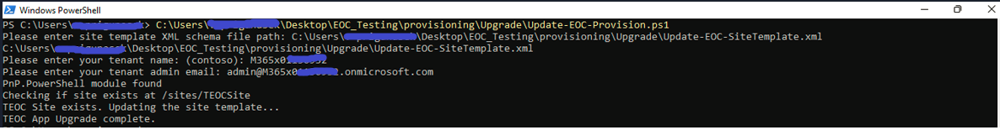

## Upgrade to version 1.0 from 0.5 or 0.5.1

### 1. Run the upgrade PowerShell script
  
  1. Clone the [repository](https://github.com/OfficeDev/microsoft-teams-emergency-operations-center.git) locally. Open the `Deployment/provisioning/Upgrade` folder to get the latest provisioning files i.e `Update-EOC-Provision.ps1` and `Update-EOC-SiteTemplate.xml`

  2. If you have customized the site name already as mentioned [here](https://github.com/OfficeDev/microsoft-teams-emergency-operations-center/wiki/Customizations#site-name-customization), then update the same site name in the Update-EOC-Provision.ps1 script, otherwise skip this step.

      
  
  3. Run the PowerShell script (Update-EOC-Provision.ps1) as an Administrator, script will ask for below inputs,
    
    * XML file path – enter fully qualified path of the XML file (Ex: C:\Scripts\Update-EOC-SiteTemplate.xml) 
    * Tenant Name – Name of the tenant where the SharePoint site was already provisioned (Ex: Contoso)
    * Tenant Admin Email – Email of tenant admin account (Ex: `abc@contoso.com`)  
 
  

### 2. Add new application setting in the App Service

  1. In Azure portal, navigate to TEOC resource group, open app service and click on Configuration.

  2. Click on "New application setting" and add **REACT_APP_SHAREPOINT_SITE_NAME** as the Name and **TEOCSite** as the value and click on OK.
  >Note: If you have already customized the site name during inital deployment, then use that sitename instead of TEOCSite.

 
  

### 3. Sync latest version

  1.  In Azure portal, navigate to TEOC resource group, open app service and click on deployment center.

  2.  Click on sync.

  3.  Wait until you see status as success for sync.

### 4. Update version

1.  Delete existing app from teams admin center.

2.  Refer [6.Create the Teams app packages](https://github.com/OfficeDev/microsoft-teams-emergency-operations-center/wiki/Deployment-Guide#6-create-the-teams-app-packages) section of deployment guide.

3.  Refer [7.Install the app in Microsoft Teams](https://github.com/OfficeDev/microsoft-teams-emergency-operations-center/wiki/Deployment-Guide#7-install-the-app-in-microsoft-teams) section from deployment guide to upload updated zip.

